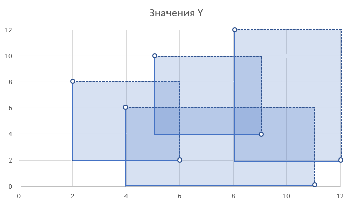
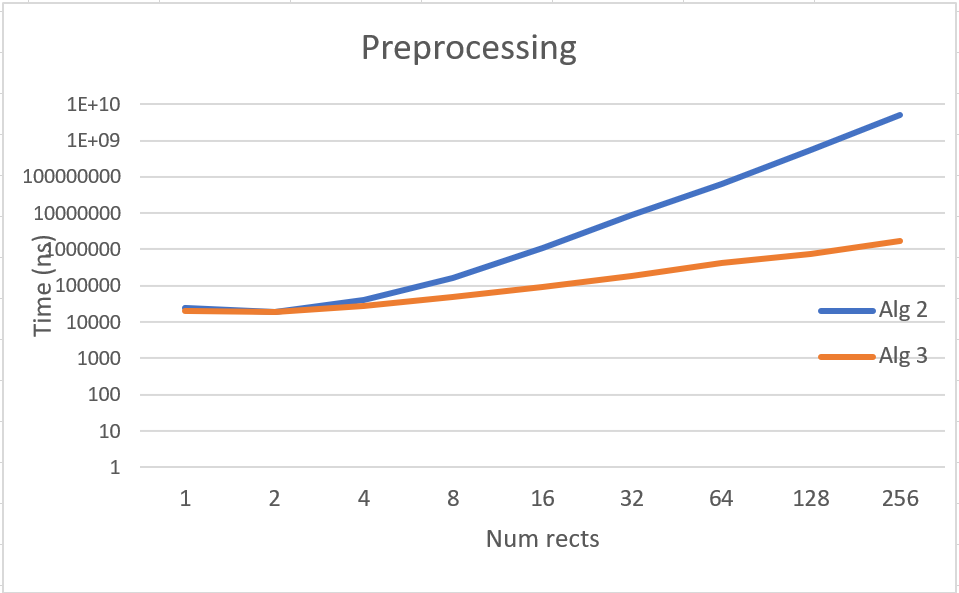
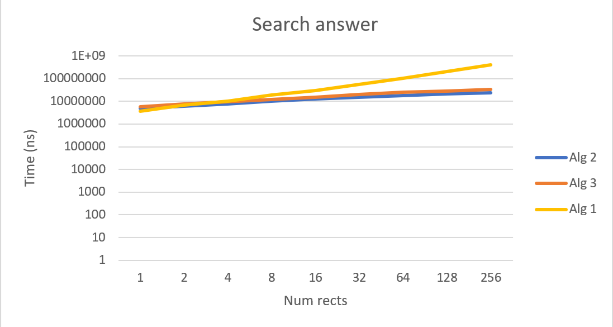

# Точка в прямоугольниках
## Задача
Даны *прямоугольники* на плоскости с углами в целочисленных координатах ([1..109],[1..109]). Требуется как можно быстрее выдавать ответ на вопрос *«Скольким прямоугольникам принадлежит точка (x,y)?»* И подготовка данных должна занимать мало времени.
==UPD: только нижние границы включены => (x1<= x) && (x<x2) && (y1<=y) && (y<y2)==
### Пример
**Прямоугольники**: {(2,2),(6,8)}, {(5,4),(9,10)}, {(4,0),(11,6)}, {(8,2),(12,12)}
**Точка-ответ**:
(2,2) -> 1
(12,12) -> 0
(10,4) -> 2
(5,5) -> 3
(2,10) -> 0
(2,8) -> 0

### Цели
- Реализовать три разных решения задачи  
- Выяснить при каком объеме начальных данных и точек какой алгоритм эффективнее.
## Описание и реализация алгоритмов
### Алгоритм перебора
**Подготовка**: `O(1)`
**Поиск**: `O(N)`, где `N` - количество прямоугольников
**Описание**: Алгоритм без предварительной подготовки данных. При поиске происходит полный перебор всех прямоугольников и явно проверяется каждая точка принадлежности каждому из `N` прямоугольников.
```c++
std::vector<int> Alg1Naive::CalcAnswers(std::vector<Rectangle>& rects, std::vector<Point>& points){
    std::vector<int> ans(points.size(), 0);
    for (size_t i = 0; i < points.size(); i++)
        for (auto& rect : rects)
            if (points[i].x >= rect.lower_left.x && points[i].y >= rect.lower_left.y && points[i].x < rect.upper_right.x && points[i].y < rect.upper_right.y)
                ans[i]++;
    return ans;
}
```
### Алгоритм на карте
**Подготовка**:` O(N^3)`
**Поиск**: `O(logN)`, где `N` - количество прямоугольников
**Описание**: Сжимаем координаты для прямоугольников. Строим по ним карту и проверяем каждую точку, какое число будет на этой карте по соответствующим координатам для точки - стольким прямоугольникам она и принадлежит.
```c++
std::vector<int> Alg2Map::CalcAnswers(std::vector<Rectangle>& rects, std::vector<Point>& points){
    std::vector<int> ans(points.size(), 0);
    for (size_t i = 0; i < points.size(); i++)
    {
        int xIndPoint = BinSearch(x_proj_vec, points[i].x);
        int yIndPoint = BinSearch(y_proj_vec, points[i].y);
        if (xIndPoint < 0 || yIndPoint < 0)
            ans[i] = 0;
        else
            ans[i] = mat[yIndPoint][xIndPoint];
    }
    return ans;
}
```
*Рассмотрим каждое действие подробнее:*
- **Сжатие координат прямоугольников**. Для этого нужно записать все координаты прямоугольников по `x` в массив `x_proj_vec`, координаты по `y` в массив `y_proj_vec`. Далее следует отсортировать массивы по возрастанию `x` и удалить дубликаты (можно просто использовать `set`). Индексы полученных массивов будут являться сжатыми координатами.
```c++
std::pair<std::vector<int>, std::vector<int>> Alg2Map::CompressCoords(std::vector<Rectangle>& rects){
    std::set<int> x_proj, y_proj;
    for (auto& rect : rects)
    {
        x_proj.insert(rect.lower_left.x); x_proj.insert(rect.upper_right.x);
        y_proj.insert(rect.lower_left.y); y_proj.insert(rect.upper_right.y);
    }
    return {std::vector<int>(x_proj.begin(), x_proj.end()), std::vector<int (y_proj.begin(), y_proj.end())};
}

void Alg2Map::Preprocess(std::vector<Rectangle>& rects, std::vector<Point>& points){
    std::pair<std::vector<int>, std::vector<int>> compressedCoords = CompressCoords(rects);
    x_proj_vec = compressedCoords.first;
    y_proj_vec = compressedCoords.second;
    std::map<int, int> xScale, yScale;
    for (size_t i = 0; i < x_proj_vec.size(); i++)
        xScale[x_proj_vec[i]] = i;
    for (size_t i = 0; i < y_proj_vec.size(); i++)
        yScale[y_proj_vec[i]] = i;
    ...
```
Т.е. по сути мы делаем как бы `buckets`, в которых потом будем проверять наличие точек.
- **Построение матрицы карты по полученным сжатым координатам.** Для каждого из прямоугольников необходимо найти индексы в матрице по сжатым координатам и в промежутке между найденными границами отметить наличие прямоугольника. Это можно делать с помощью *бинарного поиска*, ибо сжатые координаты будут отсортированы.
```c++
void Alg2Map::Preprocess(std::vector<Rectangle>& rects, std::vector<Point>& points){
	...
    mat = std::vector<std::vector<int>>(y_proj_vec.size(), std::vector<int>(x_proj_vec.size(), 0));
    for (auto& rect : rects)
        for (size_t y = yScale[rect.lower_left.y]; y < yScale[rect.upper_right.y]; y++)
            for (size_t x = xScale[rect.lower_left.x]; x < xScale[rect.upper_right.x]; x++)
                mat[y][x]++;
}
```
### Алгоритм на дереве
**Подготовка**: `O(N * logN)`
**Поиск**: `O(logN)`,  где `N` - количество прямоугольников
**Описание**: Необходимо сжать координаты (*см. Алгоритм на карте*) и построить по сжатым координатам y (`y_proj_vec`) *персистентное дерево отрезков*. Для ответа нужно найти нужный корень для данной точке в массиве `roots` посредством бинарного поиска нужного индекса в массиве `y_proj_vec` и осуществить спуск по дереву до нужного листа, просчитывая в процессе количество встретившихся прямоугольников.
```c++
int Alg3SegTree::GetAnswer(Node* node, int target){
    if (node) {
        int mid = (node->leftInd + node->rightInd) / 2;
        if (target < mid)
            return node->val + GetAnswer(node->left, target);
        return node->val + GetAnswer(node->right, target);
    }
    return 0;
}
std::vector<int> Alg3SegTree::CalcAnswers(std::vector<Rectangle>& rects, std::vector<Point>& points){
    std::vector<int> ans(points.size(), 0);
    for (size_t i = 0; i < points.size(); i++)
    {
        int xIndPoint = BinSearch(x_proj_vec, points[i].x);
        int yIndPoint = BinSearch(y_proj_vec, points[i].y);
        if (xIndPoint < 0 || yIndPoint < 0)
            ans[i] = 0;
        else
            ans[i] = GetAnswer(roots[xIndPoint], yIndPoint);
    }
    return ans;
}
```
*Рассмотрим каждое действие подробнее:*
- Сжатие координат (функция, описанная выше)
- Построение персистентного дерева отрезков. Для этого потребуется дополнительная структура - `Scan`. Она представляет собой результат реакции мнимой сканирующей прямой по нашей плоскости. Сама сканирующая прямая - вертикальная линия и она как бы идёт слева направо и фиксирует точки `x_action`, где он входит или выходит из очередного прямоугольника, `y_begin` - начало очередного прямоугольника (его потолок), `y_end` - конец очередного прямоугольника (его пол) и `f_action` - `+1` на входах в прямоугольник и `-1` на выходах из них
- Далее следует построить пустое дерево отрезков и добавить персистентные узлы
### Тестирование и выводы
*Данные для проведения тестов генерировались по следующим условиям:*
- **Для тестового набора прямоугольников** - набор вложенных друг в друга прямоугольников. имеющих координаты с шагом больше 1: `{(10*i, 10*i), (10*(2*N-i), 10*(2*N-i))}`
- **Для тестового набора точек** - неслучайный набор координат точек распределенных равномерно по ненулевому пересечению прямоугольников - хэш функции от i с разным базисом для x и y: `(p*i)^31%(20*N)`, `p` - большое простое, разное для x и y.
- **Количество прямоугольников** равно `2 ^ i`, где `0 <= i <= 8
### Измерение времени подготовки

На графике видно, что с ростом количества прямоугольников, время обработки данных *алгоритма на карте* начинает резко расти. Такая ситуация возникла из-за большой асимптотики построения карты - `O(N ^ 3)`. 
Построение *персистентного дерева* на небольших числах выполняется приблизительно за то же время, что и построение карты, однако с увеличением количества данных рост намного медленнее, поэтому алгоритм на дереве позволяет производить предобработку в несколько раз быстрее, чем алгоритм на карте. 
*Алгоритм полного перебора* не затрачивает время на дополнительную подготовку данных, поэтому график по нему строить бессмысленно.
### Измерение поиска ответа

 На небольших входных данных алгоритмы работают за равное время, однако при увеличении количества прямоугольников до `8` и больше время работы *алгоритма полного перебора* быстро растет. 
 *Подведём итог алгоритмов с предобработкой*: 
	 В основном алгоритм на карте лучше справляется с поиском ответа, чем алгоритм на дереве, несмотря на одинаковую асимптотику. Это происходит, потому что алгоритм на дереве сначала использует дважды бинарный поиск для нахождения индексов `x` и `y` координат точки в массивах сжатых координат, а затем осуществляет спуск по дереву - константа перед логарифмом больше, чем у алгоритма на карте. 
### Итог
Подводя итоги, можно сказать, что *полный перебор* можно использовать на небольших данных для поиска ответа без затрат на дополнительную подготовку и память. *Алгоритм на карте* будет уместен при маленьком количестве прямоугольников и любом количестве запрашиваемых точек. Он не так сильно затратен в вопросе реализации, нежели алгоритм на *персистентном дереве отрезков*. Однако именно последний алгоритм будет хорошо справляться с поиском ответа на любых данных.
